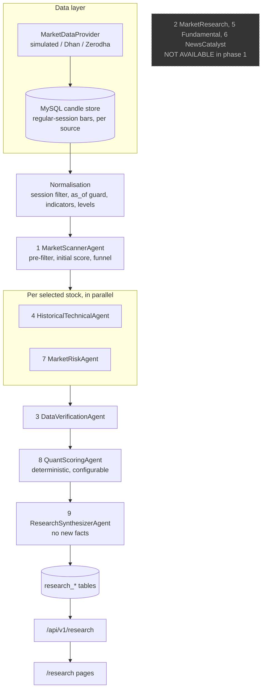

# AI-assisted market research (phase 1)

A research and **decision-support** module for Indian equities, inside the existing platform. It scans a stock
universe, measures each stock against explicit rules, and produces an explainable, sourced report. It never places
an order and never says "buy".

> Nothing here is investment advice. A high research score describes how a setup measures up against rules on the
> data available at the time. It has **not** been shown to predict profit.

## What phase 1 is, and is not

| Built and working | Not built yet |
|---|---|
| Market scanner over a universe (NIFTY 50 seeded, custom lists) | News and catalyst analysis (needs a news source and an LLM key) |
| Multi-timeframe technical analysis, price action, intraday levels | Corporate announcements, results calendar, corporate actions |
| Historical setup statistics with sample-size rules and cost adjustment | Fundamentals, valuation, shareholding, promoter pledge |
| Market regime, breadth, VIX, sector rotation (rule based, with factors) | ASM/GSM surveillance, circuit limits, event proximity |
| Data verification with a source-independence rule | Global markets, USD/INR, crude, FII/DII activity |
| Deterministic, configurable scoring with evidence for every component | Backtesting whether scores predicted anything |
| Separate Data Confidence, freshness and staleness handling | PDF export, alerts (Telegram, Discord, email), scheduled runs |
| Run history, score history and explained score changes | An LLM anywhere in the pipeline |
| Configurable weights with explicit approval, source registry | |
| JSON and CSV export, 23 API endpoints, research pages | |

The missing agents are listed in every run as `NOT_AVAILABLE`, and every report has a "not assessed" list, so a report
can never look more complete than it is.

## Architecture



* Agents exchange typed Pydantic models (`backend/app/research/contracts.py`), never free text.
* Every agent returns the same envelope: agent, status, confidence, timestamp, findings, metrics, risks, sources, warnings.
* `ResearchOrchestrator` (`research/orchestrator.py`) runs the funnel in a background task. Network fetches are
  concurrent and bounded; all database work is serialised in short transactions so the UI can poll live progress.
* Only one run can be active at a time. A run interrupted by a restart is marked FAILED on the next start.

### Depth

| Depth | Stocks fully analysed | What runs |
|---|---|---|
| Quick | top 10 by scanner score | scanner, technicals (15m, 30m, 1h, daily), risk, scoring, synthesis |
| Standard | top 20 | Quick plus 5-minute data, historical setup statistics, verification |
| Deep | up to 50 | Standard plus weekly timeframe and the widest funnel |

The scanner's `initial_score` only decides who gets analysed. It is never shown as the research score.

## Scoring methodology

The score is calculated from ten components whose weights live in the database (`research_weight_sets`).

| Component | Default points | Main inputs |
|---|---|---|
| Market Regime | 10 | regime label versus the setup direction, high-VIX penalty |
| Liquidity | 15 | 20-session average traded value, average volume, bid/ask spread when the provider supplies depth |
| Price Action | 15 | daily swing structure, VWAP distance, breakout of prior-day/opening range, nearby opposing level, gap behaviour |
| Momentum | 10 | RSI (15m and daily), MACD histogram, ADX with DI direction, 10-day ROC, return versus NIFTY |
| Volume | 10 | relative volume against the same time of day, volume spike, price/volume relationship |
| Volatility Suitability | 10 | daily ATR% in a sweet spot (1.0% to 2.5% by default), today's range versus normal |
| Technical Setup | 10 | trend and EMA-stack agreement across 15m, 30m, 1h and daily, Supertrend, breakout, "already stretched" penalty |
| News / Catalyst | 10 | **not assessed in phase 1** |
| Historical Setup Quality | 5 | success rate and after-cost expectancy of past similar setups, only when the sample is adequate |
| Risk | 5 | starts full; each flag removes a share of the points (HIGH 50%, WARNING 20%, INFO 5%) |

Rules that keep the number honest:

* **Direction first.** A bias (BULLISH, BEARISH, NEUTRAL) comes from five votes: price versus VWAP, 15m trend, daily trend,
  15m MACD histogram and day change. A NEUTRAL setup earns only partial credit in the alignment-based components.
* **Not assessed is not zero.** The score is `earned points / points that could be assessed x 100`. The report shows
  `score_coverage_pct`, so a missing component neither hides nor inflates the result.
* **Risk cap.** Any HIGH-severity risk flag caps the final score (70 by default). `score.capped` and `cap_reason` say so.
* **Evidence.** Each component lists its evidence. A tick, cross or neutral mark follows the sub-score that produced it, and
  each item cites a source key from `report.sources`.
* **Labels.** Setup quality is STRONG at 75 or more, MODERATE at 55 or more, otherwise WEAK (configurable).
* **Weights are configurable.** Propose a set with `POST /research/weights` (must add up to 100). It changes nothing until an
  administrator approves it. The active set id and version are stored with every score. The system never changes weights on its own.

### Data Confidence (separate from the score)

```
confidence = 100 x (0.35 x source reliability + 0.20 x freshness + 0.20 x verification
                   + 0.15 x completeness + 0.10 x sample adequacy)
```

* Source reliability comes from the source registry (official 1.0, news 0.9, portals 0.8, other 0.5; **synthetic data 0.1**).
* Synthetic data can never score above **30**, whatever else is perfect. Every report then carries a banner.
* Verification statuses are weighted VERIFIED 1.0, PARTIALLY_VERIFIED 0.7, UNVERIFIED 0.4, STALE 0.25, CONFLICTING 0.15.

### Verification

* VERIFIED needs agreement between at least two **independent origins**. Two feeds from one provider count as one origin, so a
  single data vendor can reach at most PARTIALLY_VERIFIED. In phase 1 there is one provider, so nothing is VERIFIED, and that
  is stated in the claim's detail.
* Claims checked: current price (quote and candles), session volume (5m versus 15m, skipped for synthetic data with a stated
  reason), bar integrity (OHLC order, duplicates, missing bars). Conflicts are shown with both values and
  "Awaiting verification. No value was chosen."
* Freshness compares the newest complete bar with the analysis time (20 minutes while the market is open) or with the
  last expected session when it is closed.

### Historical setup statistics

* Today's setup is (gap bucket, price side of VWAP, relative-volume bucket) at the current time of day. Past sessions with the
  same setup are found and their next 15 minutes, 30 minutes and hour are measured in the setup direction.
* Statistics are stated only when the sample reaches `min_sample` (30). Below that only the count is shown, with a note.
  The matcher falls back from the exact setup to broader ones and reports which one it used.
* Every statistic shows sample size, period, success rate, average, median, average after an estimated 0.10% round-trip cost,
  average maximum favourable and adverse excursion, and the chance of reaching +0.3%, +0.5% and +1.0%.
* The current session is never in the sample. When the market has closed, the setup is evaluated at 14:30 IST, the last point
  where a one-hour outcome can still be measured, and the report says so.
* On random data these statistics show roughly 50% success and a negative result after costs, which is what an honest
  measurement should show when there is no edge.

### Market regime, breadth and sectors

* Regime is a vote of explicit factors: NIFTY versus its 20 and 50-day EMAs, EMA20 versus EMA50, day change, BANK NIFTY versus
  its EMA, advance/decline and the share of stocks above their EMA20. Every factor is listed with its value. India VIX sets
  the volatility label (20 and above is HIGH, 12 and below is LOW).
* **Breadth is computed over the scanned universe, not the whole exchange.** The report says so.
* Sectors are ranked by average one-day and five-day return relative to NIFTY, with breadth, momentum and relative volume.

## Data and sources

| Need | Status |
|---|---|
| Price bars and volume | Any `MarketDataProvider`. Default is the **synthetic** simulated feed. Dhan and Zerodha adapters exist and are untested against the live services |
| Bid/ask spread | Only when the provider returns market depth (the Dhan quote adapter maps it). Never guessed |
| Index data (NIFTY, BANK NIFTY, INDIA VIX) | Same provider. The Dhan index security ids (13, 25, 21) come from Dhan's instrument master |
| Stock universe and sectors | NIFTY 50 seed in `research/reference/nifty50.py`. Tokens come from Dhan's public instrument master; sectors are a hand-maintained static list |
| Everything else | Not connected. See the source registry (`GET /research/source-registry`), where each source shows whether an adapter exists |

For real research, set `MARKET_DATA_PROVIDER=dhan` (with credentials and a Data API subscription). Until then every report
is labelled synthetic and its data confidence is capped at 30.

## How to run research

**In the app:** open **Research**, click **New Research Scan**, choose the universe and depth, and watch the agent status.

**Over HTTP** (add a bearer token when authentication is on):

```bash
curl -X POST localhost:8000/api/v1/research/run -H 'content-type: application/json' \
  -d '{"universe":"NIFTY50","depth":"STANDARD"}'          # returns immediately with a run id
curl localhost:8000/api/v1/research/runs/<run id>           # poll progress
curl localhost:8000/api/v1/research/candidates              # Top Research Candidates
curl localhost:8000/api/v1/research/RELIANCE                # the full report
curl "localhost:8000/api/v1/research/RELIANCE/export?format=csv" -o report.csv
```

`as_of` lets you analyse the market as it was at an earlier time (up to 300 days back). Only bars complete at that time are used.

**Timing** (synthetic feed, real MySQL): a cold NIFTY 50 run takes about a minute because it fills the candle store
(about 416,000 bars); a repeat run takes about 15 seconds. With a real provider the cold run is limited by its API rate.

## API

Full contract: [API_CONTRACT.md](API_CONTRACT.md#research-ai-assisted-market-research-phase-1). Exact schemas: `research_openapi.json`.
Sample responses: `research_samples/`.

`POST /research/run`, `GET /research/summary`, `/runs`, `/runs/{id}`, `/candidates`, `/candidates/{symbol}`, `/market`, `/sectors`,
`/weights` (+ approve), `/source-registry`, `/universes`, and per stock `/{symbol}`, `/history`, `/score-history`, `/technical`,
`/risk`, `/sources`, `/export`. `/{symbol}/news` and `/{symbol}/fundamentals` answer **501** until a source exists.

## Database

Migration `research module` adds 15 tables: `research_runs`, `research_agent_runs`, `research_agent_outputs`,
`research_candidates`, `research_scores`, `research_score_components`, `research_claims`, `research_verifications`,
`research_market_snapshots`, `research_sector_snapshots`, `research_historical_patterns`, `research_risk_events`,
`research_sources`, `research_weight_sets`, `research_universe_members`. It also makes the candle uniqueness key include the
data `source`, so real and synthetic bars can never overwrite or mix with each other.
`research_news` and `research_corporate_events` from the specification are deliberately not created yet, because nothing would write to them.

The migration was tested on MySQL 8.4: upgrade over existing data, downgrade, re-upgrade and a fresh install, with no schema drift.

## Configuration

| Variable | Default | Meaning |
|---|---|---|
| `RESEARCH_FETCH_CONCURRENCY` | `4` | Concurrent provider requests during a run |
| `RESEARCH_HISTORY_DAYS` | `400` | Calendar days of 15-minute history loaded per stock (about 260 sessions) |
| `MARKET_DATA_PROVIDER` | `simulated` | Set to `dhan` for real bars |

Scoring weights and thresholds are **not** environment variables. They are stored in the database and changed through the approval flow.

## Tests

```bash
cd backend && .venv/bin/pytest -q tests/test_research_*.py
```

Covered: indicators (cross-checked against the `ta` library), sessions and look-ahead guard, feature engine, historical
statistics (sample rules, costs, no future data), scoring behaviour required by the specification (liquidity, risk,
missing, conflicting and stale data, small samples), verification and source independence, risk flags, market regime,
scanner, score-change explanations, and a full end-to-end run over HTTP including weight approval and administrator-only approval.

## Deviations from the specification, and known limitations

* **Risk in the weight table.** The specification lists Risk as a 5-point penalty in one place and shows a 10-point "Risk 10/10" in
  its breakdown example. Phase 1 follows the weight table (Risk = 5 points), and adds a configurable score cap for HIGH flags.
* **Universe membership is approximate and not versioned.** Historical scores therefore have survivorship bias, and the module
  cannot rebuild past index constituents.
* **Research score versus outcomes is not measured.** `as_of` supports point-in-time research, but the specification's score
  calibration and bucket backtest (section 34) are not built. Do not assume a higher score means a higher chance of profit.
* **No LLM.** The synthesizer is deterministic and only rearranges measured facts. An LLM belongs in news classification and
  wording in phase 2, never in numbers.
* **Source rate limits** are stored in the registry but only a global concurrency limit is enforced. Nothing is scraped, so
  `robots.txt` handling is not needed yet, and must be built before any web source is added.
* **Redis** is not used for research caching. The MySQL candle store is the cache.
* **Observability** is structured logging with run ids. OpenTelemetry metrics (durations, failure rates, conflicts) are not emitted yet.
* Dhan and Zerodha access is verified only against mocked HTTP. Index segments and depth parsing for Dhan are unverified against the live API.
* Historical charts in the UI use the stored history (about 400 days), so 3-year and 5-year ranges are not offered.
* The 20 or so analysed stocks per run are chosen by the scanner's rough score. A stock outside the top of that ranking is scanned but not analysed.

## Suggested next steps

1. Connect real market data (Dhan) and re-run; validate the Dhan adapter, index ids and depth in the sandbox.
2. Bulk instrument-master import, and a maintained universe for NIFTY 100 and 500.
3. Phase 2: news and corporate announcements from permitted sources, an LLM for classification and wording only, source rate limiting.
4. Score calibration: store forward returns per score and test whether score buckets mean anything.
5. Scheduled pre-market, intraday and post-market runs, and alerts.
